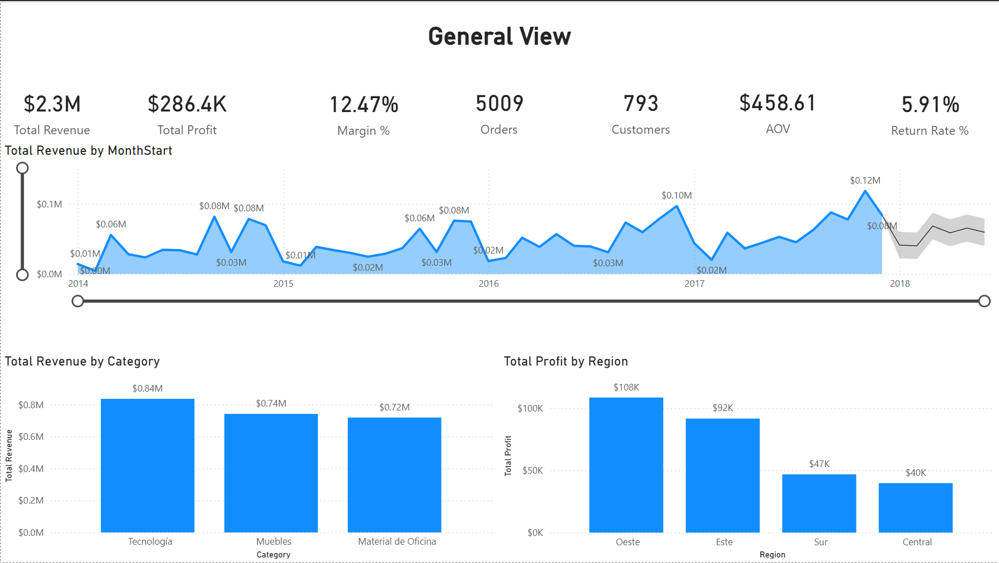
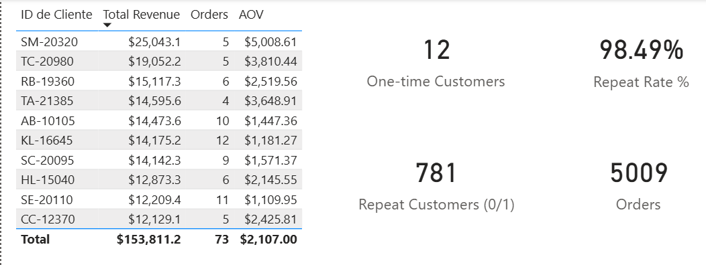
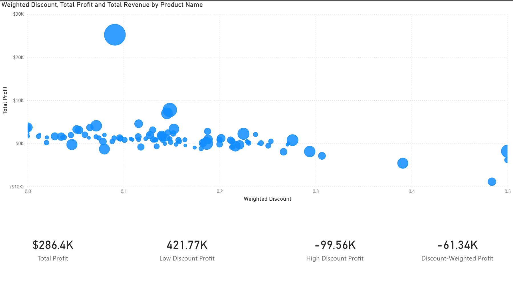
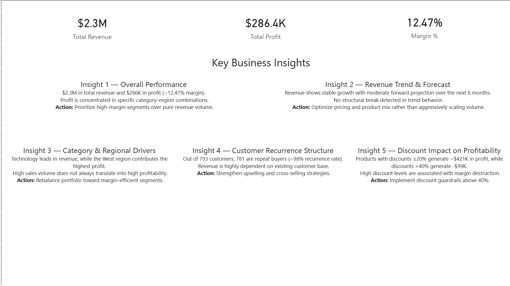

# Retail Performance & Profitability Analytics
Technical Data Analyst portfolio project (Power BI • DAX • dimensional modeling).

_Proyecto de portafolio para Analista de Datos enfocado en rentabilidad retail, BI (Power BI) y modelado dimensional._

## Project Overview
Power BI report focused on retail profitability, repeat customer behavior, and discount effectiveness.
Built on a star schema with a small, reusable DAX measure layer to keep KPIs consistent across pages.

### (ES) Descripción general
Informe de Power BI centrado en **rentabilidad retail**, comportamiento de clientes recurrentes y efectividad de descuentos, construido sobre un **modelo estrella** con una capa pequeña de medidas DAX reutilizables para mantener KPIs consistentes en todas las páginas.

## Target roles

This project is designed as a **portfolio case for Data Analyst / BI Analyst roles**, because it demonstrates:

- **Dimensional modeling (star schema)** applied to a realistic retail scenario.
- Design and calculation of **business KPIs** (Revenue, Profit, Margin %, customer recurrence, discount effectiveness).
- An **executive Power BI report** focused on explaining profitability drivers and customer behavior.

**At a glance (from the report)**
- **Total Revenue**: ≈ **$2.3M**
- **Total Profit**: ≈ **$286.4K**
- **Margin**: ≈ **12.47%**
- **Customers**: **793**
- **Repeat Customers**: **781** (≈ **98%** recurrence)

**Docs**
- [Project notes](docs/PROJECT_NOTES.md) (assumptions, modeling, measures, validation)
- [Interview talk track](docs/INTERVIEW_TALK_TRACK.md) (60–90s talk track + likely questions)

## Repository Structure
- `screenshots/` — report page previews (PNG exports)
- `docs/` — project notes and interview talk track
- `sql/` — placeholder for future SQL exercises
- `assets/` — optional supporting files (kept empty by default)

## Business Questions
- What are revenue, profit, and margin trends over time?
- Which products and customer segments drive profit (and which erode it)?
- How concentrated is performance across customers and products?
- How strong is repeat purchasing behavior?
- Do discounts improve profit, and where do they begin to reduce it?

## Data Model
**Tables**
- **FactSales**: transaction grain (Revenue, Profit, DiscountPct, and foreign keys)
- **DimDate**: calendar attributes for time slicing
- **DimProduct**: product attributes and hierarchy
- **DimCustomer**: customer attributes

**Relationships (star schema)**
- `DimDate` **1 → * ** `FactSales`
- `DimProduct` **1 → * ** `FactSales`
- `DimCustomer` **1 → * ** `FactSales`
- Single-direction filtering from dimensions to the fact table.

## Key DAX Measures
**Profitability**
- **Total Revenue**
- **Total Profit**
- **Margin %**

**Customer behavior**
- **Customers**
- **Repeat Customers**
- **Repeat Rate %**

**Discount effectiveness**
- **Weighted Discount** (revenue-weighted discount rate)
- **Low Discount Profit (≤20%)** (≈ **+$421.77K**)
- **High Discount Profit (>40%)** (≈ **-$99.56K**)
- **Discount-Weighted Profit** (≈ **-$61.34K**)

## Report Pages + screenshots
### Executive Overview
KPIs, trends, and drivers; forecast uses **Power BI native forecasting** (not an advanced statistical model).

### Customer Behavior
Customer count and repeat behavior (793 customers, 781 repeat customers; ~98% recurrence).

### Discount Analysis
Scatter chart for product-level discount impact: **x = Weighted Discount**, **y = Total Profit**, **size = Total Revenue**, grouped by **Product**.

### Key Insights
Executive summary page that consolidates the main takeaways into action-oriented statements.

## Key Insights
- **Total Revenue ≈ $2.3M**, **Total Profit ≈ $286.4K**, **Margin ≈ 12.47%**.
- **Customers = 793** with **Repeat Customers = 781** (≈ **98%** recurrence).
- **Low Discount Profit (≤20%) ≈ +$421.77K**.
- **High Discount Profit (>40%) ≈ -$99.56K**.
- **Discount-Weighted Profit ≈ -$61.34K**, indicating profit is disproportionately associated with discounted sales.

## How to Use
- The `.pbix` file is **not uploaded** to this repository.
- Use this repo to review the **model design**, the **measure set**, and the **report layout** via the screenshots in `screenshots/`.
- The measure themes above map directly to the visuals shown on each page (KPIs, repeat behavior, discount scatter).

## Technical Stack
- **Power BI Desktop** (data model, visuals, interactions)
- **DAX** (measures for KPIs, recurrence, discount analysis)
- **Power Query** (data shaping, as needed)
- **Dimensional modeling** (star schema)
 
## Skills demonstrated
- **Dimensional modeling (star schema)** for retail analytics.
- **DAX measure design** for profitability, customer behavior and discounts.
- **Executive storytelling**: KPIs and visuals structured for non-technical stakeholders.
- Ability to **translate business questions into KPIs and report pages**.

## Relevance for Data / BI roles
- Fits typical responsibilities of **Data Analyst / BI Analyst** roles: build star schemas, define KPIs and create dashboards.
- Shows ability to work end-to-end: from raw dataset → data model → measures → report → **business insights**.
- Provides a concrete example to discuss in interviews (trade-offs, assumptions, limitations).
